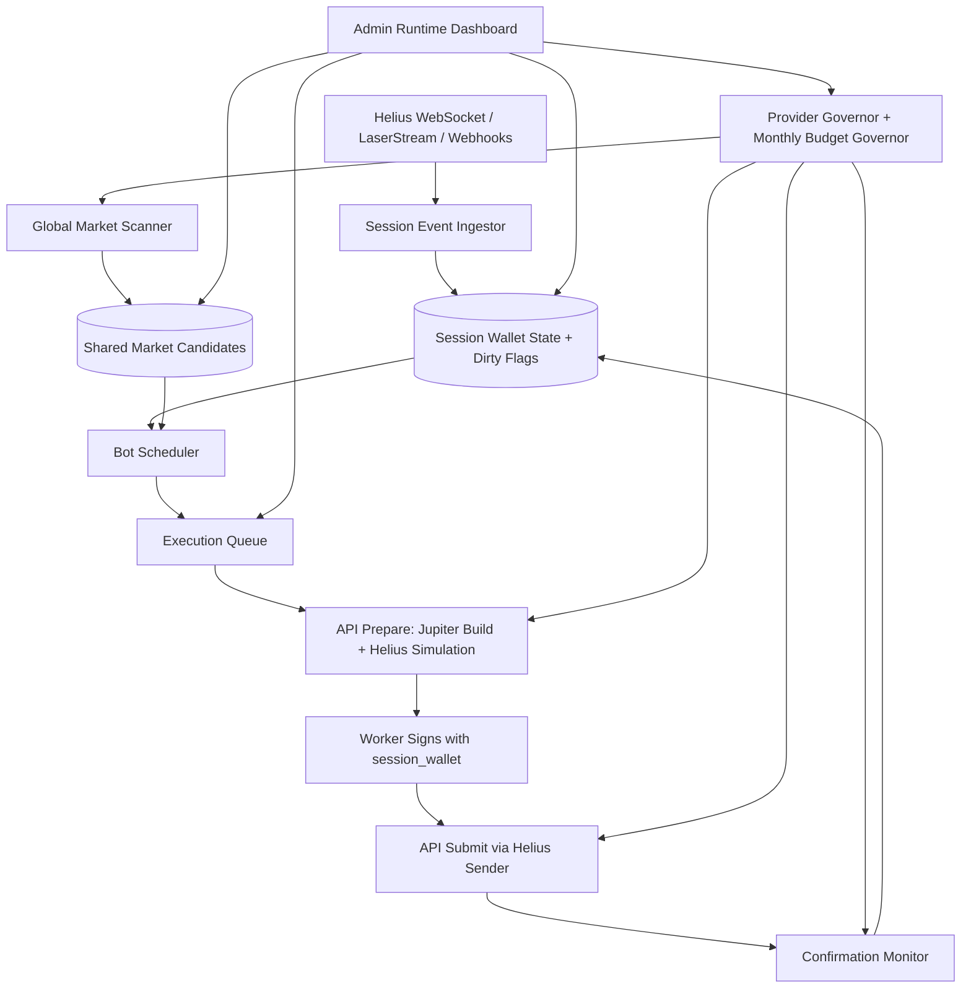

# RogueZero 350-Bot Runtime Architecture

Status: design control document  
Scope: infrastructure/runtime architecture for supporting up to 350 concurrent bot sessions without uncontrolled provider usage, unsafe fund handling, or duplicated market scanning.

## Purpose

RogueZero must scale by changing runtime architecture, not by only increasing provider rate-limit numbers.

This document defines the intended 350-bot architecture, implementation gates, safety rules, provider usage model, and rollout plan. Future scaling work should be checked against this document before implementation.

Companion research document: `docs/350-bot-speed-research-plan.md`. Use it before finalizing Glide/Pulse/Surge cadence, queue limits, provider thresholds, scanner cadence, or max-open-position math.

## Non-negotiable invariants

- Preserve `owner_wallet` versus `session_wallet`.
  - `owner_wallet` is identity, access, and return-wallet anchor.
  - `session_wallet` is the ephemeral taker/signer/fee-payer for automated execution.
- Preserve the API and worker split.
  - API owns external Jupiter/Helius calls and persistence-facing HTTP control.
  - Worker owns bot runtime decisions and signs prepared transactions with session keys.
- Do not move bot runtime into browser sessions.
- Do not collapse all logic into one unbounded loop.
- Do not let each bot independently scan the same market universe.
- Do not assume multiple Helius API keys multiply account-level quotas unless Helius explicitly confirms it.
- Do not ship 350 live funded sessions before simulated 350-session proof passes.
- Fail toward halt, preserve state, and return funds where possible.

## Provider plans assumed for target design

### Jupiter Pro

Verified planning assumptions:

- General API bucket: 150 RPS.
- Sliding window: 60 seconds.
- Limits are per account, not per API key.
- `/swap/v2/build` uses the general bucket.
- Dedicated submit/execute buckets exist for paid plans, but RogueZero currently submits signed transactions through Helius/Sender path.

Planning cap:

- Use no more than roughly 135 RPS general under normal operation to preserve headroom.
- Treat this as a 10% reserved-headroom rule: the runtime governor should plan against 90% of documented account-level RPS, not the full limit, unless an operator intentionally overrides during an incident.

### Helius Business

Verified planning assumptions:

- 200 RPC RPS.
- 100M credits/month.
- 50 `sendTransaction` per second.
- 5 `sendBundle` per second.
- 50 DAS RPS.
- 50 `getProgramAccounts` per second.
- Enhanced WebSockets available.
- LaserStream gRPC mainnet available on Business and higher.
- Sender default: 50 TPS, no API credits.
- Sender requires `skipPreflight: true`, priority fee, and Sender/Jito tip.
- WebSocket/LaserStream data is metered by streamed data volume.
- Webhooks cost credits per delivered event.

Planning cap:

- Treat 200 RPC RPS as burst capacity, not sustainable 24/7 average.
- Monthly credit budget must drive degradation modes.
- Treat per-second Helius RPC usage the same way: reserve at least 10% headroom from documented RPS and let the monthly credit burn forecast lower the effective cap further when needed.

## Current scaling risks to eliminate

- Worker and API can both reserve Jupiter budget for a single external Jupiter request.
- Internal `/jupiter/swap/prepare` and `/jupiter/swap/submit` route caps can bottleneck worker/API split deployments.
- Worker currently evaluates sessions via periodic polling rather than an event-driven scheduler.
- Per-bot universe scouting duplicates work and does not scale to 350 concurrent sessions.
- Confirmation handling can become per-bot polling instead of streamed or batched status handling.
- `concurrentCapacity` is exposed in runtime profile logs but is not the full enforcement mechanism required for 350-bot scheduling.
- Current provider buckets may still reflect default-scale values rather than upgraded plan values.

## Target architecture

## Runtime model

### Event-driven first

Bots should wake because something relevant happened, not because every active session is polled constantly.

Primary wake sources:

- Wallet/account event from Helius WebSocket or LaserStream.
- Webhook event.
- Shared scanner candidate assigned or refreshed.
- Cooldown expiry.
- Pending confirmation timeout/fallback.
- Stop/settlement requirement.
- Admin/user control state change.

### Just-in-time polling second

Polling is allowed only when there is a specific reason:

- Immediately before preparing/executing a trade.
- During settlement/return flow.
- As a fallback if streams/webhooks disconnect or lag.
- During short confirmation fallback windows, preferably batched.

### Slow recovery polling third

Slow polling should exist only as resilience coverage:

- detect missed funding events;
- detect missed settlement updates;
- recover from stream/webhook downtime;
- reconcile stale sessions.

It should not be the main runtime path.

## Session state machine

Suggested scheduler states:

- `awaiting_funding`
- `ready`
- `active_idle`
- `candidate_available`
- `risk_check_due`
- `prepare_queued`
- `prepare_pending`
- `signing_required`
- `submit_queued`
- `submitted_waiting_confirmation`
- `cooldown`
- `paused`
- `stopping`
- `settling`
- `stopped`
- `error_halted`

State rules:

- `awaiting_funding`: stream/webhook first; slow fallback balance check only.
- `active_idle`: no per-bot market polling; wait for scanner candidates or timed strategy review.
- `candidate_available`: allow just-in-time validation.
- `prepare_queued` / `prepare_pending`: one in-flight prepare per session.
- `submitted_waiting_confirmation`: stream/signature subscription first; batched status fallback.
- `cooldown`: no work until `next_evaluation_at` unless safety event occurs.
- `paused`: no new entries.
- `stopping` / `settling`: safety/return lane priority.
- `error_halted`: no automatic trading; require recovery path.

## Dirty flags and scheduling fields

Minimum scheduling fields should include:

- `wallet_dirty`
- `balance_dirty`
- `position_dirty`
- `candidate_dirty`
- `risk_dirty`
- `confirmation_dirty`
- `settlement_dirty`
- `next_evaluation_at`
- `last_event_at`
- `last_wallet_event_at`
- `last_scheduler_run_at`
- `scheduler_state`
- `scheduler_reason`

Worker selection should be based on dirty flags, state, queue capacity, and `next_evaluation_at`, not a blind all-active-session loop.

## Shared market scanner

### Purpose

The scanner prevents 350 bots from independently discovering the same opportunities.

### Responsibilities

- Read configured token universe.
- Refresh shared candidates on controlled cadence.
- Rank candidate opportunities.
- Estimate route/liquidity viability.
- Persist candidates with freshness windows.
- Respect provider governor budgets.
- Degrade when provider/monthly budget pressure rises.

### Candidate fields

Suggested fields:

- `candidate_id`
- `scanner_run_id`
- `strategy_slot`
- `input_mint`
- `output_mint`
- `signal_score`
- `liquidity_score`
- `route_quality`
- `slippage_bps`
- `max_trade_size`
- `observed_at`
- `valid_until`
- `status`
- `provider_cost_estimate`
- `risk_flags`
- `consumed_count`
- `max_consumers`

### Bot behavior

Bots consume candidates only after local/session checks pass:

- session is active;
- license/access remains valid;
- wallet has sufficient SOL/token balance;
- cooldown has expired;
- per-trade and session caps pass;
- candidate remains fresh;
- risk policy allows the trade.

### Implemented foundation

Current implementation has a conservative scanner foundation inside the worker token-universe autosort path:

- stale disabled rows are excluded from token-universe price polling/autosort by default;
- `WORKER_TOKEN_UNIVERSE_INCLUDE_DISABLED_CANDIDATES=true` is required to intentionally probe disabled rows;
- the entry scout now requires a persistent bullish signal by default before selecting an alt token;
- `WORKER_UNIVERSE_SCOUT_REQUIRE_PERSISTENT_BULLISH=false` is required to allow the older weaker bullish fallback;
- the bootstrap repair script disables non-seed rows by default so old Jupiter registry imports do not remain enabled forever;
- current configured DB was repaired from 400 enabled stale tokens to a 13-token evidence-admitted liquid-core baseline on 2026-06-03: `SOL`, `USDC`, `USDT`, `JUP`, `JitoSOL`, `mSOL`, `bSOL`, `JTO`, `PYTH`, `KMNO`, `WBTC`, `W`, and `HNT`;
- higher-volatility/non-core tokens previously in the seed set (`BONK`, `RENDER`, `RAY`, `ORCA`) are disabled by default and must re-enter through a stronger admission pipeline rather than being trusted seed tokens;
- `scripts/admit-token-candidates.mjs` records quote-depth evidence in `token_admission_candidates` and only applies candidates that pass exact-mint, route-depth, impact, and blocklist checks;
- current admission evidence admits the 13 baseline tokens above and rejects known thin/blocked examples such as `CAVE` and `MOBILE`;
- worker autosort now persists shared scanner output into `market_scanner_runs` and `market_candidates` with freshness TTL, accepted/rejected status, risk flags, route quality, slippage, and signal score;
- admin Token Universe now displays the latest persisted scanner run and candidate output.

This is not the final external-data scanner. It is the first safe shared-candidate persistence layer and prevents the known failure where stale registry tokens dominate the universe.

## Execution queue

### Purpose

The execution queue prevents stampedes and protects high-priority safety operations.

### Priority lanes

1. Stop/return/settlement operations.
2. Submitted transaction confirmation and reconciliation.
3. Trade submission.
4. Trade prepare/simulation.
5. Scanner refresh.
6. Dashboard/history jobs.

### Required controls

- One in-flight execution per session wallet.
- Bounded prepare concurrency.
- Bounded submit concurrency.
- Bounded retry count.
- Blockhash expiry handling.
- Dead-letter/error state.
- Per-session cooldown.
- Provider bucket reservation.
- Monthly budget pressure checks.

### Implemented foundation

Current worker foundation routes active trade attempts through a durable `execution_queue` table before calling prepare/sign/submit. The queue is intentionally minimal first:

- one active `queued`/`running` queue item per session;
- bounded queue claims per worker tick via `WORKER_EXECUTION_QUEUE_CLAIMS_PER_TICK`;
- running item leases via `WORKER_EXECUTION_QUEUE_LOCK_MS`;
- stale running locks are reclaimed automatically;
- exit/in-position sessions receive higher priority than flat entry scans;
- actual swap duplication is still protected at the API/DB boundary by one active `prepared`/`submitted` `swap_executions` row per taker.

Admin visibility foundation:

- `GET /api/sessions/health` in `apps/admin` now reports execution queue totals, queued/running counts, claimable backlog, stale running locks, oldest queued age, newest queue update time, and top queue reasons.
- The admin Session Health tab renders these queue metrics so operators can see whether the queue is normal, backlogged, or holding stale locks.

This does not replace the future global market scanner. It gives the runtime a durable throttle point so the scanner and later priority lanes have somewhere safe to feed execution intents.

## Helius usage model

### Sender

Use for signed transaction submission when compatible.

Requirements:

- `skipPreflight: true`.
- Priority fee instruction.
- Sender/Jito tip instruction.
- Payer must be the funded `session_wallet`.

Modes:

- Default dual route: higher inclusion probability, higher minimum tip.
- SWQOS-only: lower minimum tip, potentially less aggressive routing.
- Dynamic mode: select based on urgency, congestion, trade value, and budget pressure.

### WebSocket / LaserStream

Use for:

- session wallet SOL balance changes;
- token account changes;
- transaction/signature updates;
- live dashboard freshness;
- reducing repeated HTTP RPC reads.

Production requirements:

- reconnect with exponential backoff;
- resubscribe after reconnect;
- health metrics;
- stale stream detection;
- fallback reconciliation polling.

### Webhooks

Use for:

- durable event push into API;
- funding and transfer events;
- activity/event logging;
- fallback or supplement to live streams.

Production requirements:

- idempotent event handling;
- duplicate detection;
- endpoint health monitoring;
- replay/reconcile path.

### DAS / Wallet / enhanced APIs

Use for:

- token metadata;
- dashboard/history views;
- wallet summaries;
- non-hot-path reconciliation.

Do not use these as a substitute for hot execution checks that require exact current state.

## Helius API key policy

Use multiple keys for operational separation, lane isolation, observability, rotation, and practical load balancing inside shared account-level limits. Multiple keys are useful and wise, but they are not assumed to multiply account-level quotas unless Helius explicitly confirms that for the current plan.

Suggested split:

- API execution RPC/simulation key.
- Worker fallback RPC key.
- Streaming/WebSocket/LaserStream key.
- Admin/dashboard/history key.
- Emergency rotation/testing key.

Rules:

- Keep all keys server-side.
- Do not expose keys in `apps/web`.
- Track usage per key/service.
- Route each request through the logical key/lane that matches the job; do not let dashboard/history traffic use execution keys by accident.
- Load-balance only within the provider governor's shared account-level RPS and monthly budget caps.
- Rotate keys without downtime.
- Treat account-level plan limits as shared unless Helius confirms otherwise.

## Provider governor requirements

The provider governor should evolve from simple RPS buckets into a budget-aware controller.

Required dimensions:

- provider;
- lane;
- priority;
- RPS bucket;
- monthly credit budget;
- retry budget;
- degradation mode;
- observed latency/error rate;
- budget burn forecast.

Implemented foundation:

- `provider_rate_limits` remains the shared DB token bucket table for RPS control.
- `provider_monthly_budgets` tracks month-window usage per provider budget key.
- API and worker both reserve Helius monthly budget before direct Helius RPC/Sender calls.
- API and worker both reserve Jupiter monthly request budget before direct Jupiter requests.
- Helius defaults to `HELIUS_MONTHLY_CREDIT_LIMIT=100000000` and enforcement enabled unless `HELIUS_MONTHLY_BUDGET_ENFORCE=false`.
- Jupiter defaults to `JUPITER_MONTHLY_REQUEST_LIMIT=10000000` with enforcement disabled unless `JUPITER_MONTHLY_BUDGET_ENFORCE=true`, because Jupiter Pro is primarily RPS-limited rather than credit-limited.
- Budget pressure emits `watch` / `throttle` warnings before hard exhaustion.
- Protected API endpoint `GET /provider/budgets` returns current Helius/Jupiter budget pressure, usage ratio, remaining units, and projected usage ratio for ops/admin surfaces.
- Admin-local endpoint `GET /api/provider/budgets` reads `provider_monthly_budgets` for the current UTC month and falls back safely before the table exists.
- The admin Rate Limits tab renders Helius monthly credits and Jupiter monthly request budget cards with used, remaining, current usage ratio, projected usage ratio, and pressure state.

Suggested modes:

- `normal`
- `watch`
- `degraded`
- `execution_only`
- `halt_new_entries`

Mode behavior:

- `normal`: all runtime systems enabled.
- `watch`: lower scanner frequency and raise candidate threshold.
- `degraded`: only high-score candidates; reduce dashboard/history refresh.
- `execution_only`: no new scanner work; finish, confirm, settle existing work.
- `halt_new_entries`: no new trades; only safety, return, and admin recovery operations.

## Glide / Pulse / Surge automated runtime throttle

Glide, Pulse, and Surge are the operator-facing runtime speed modes that make the provider governor understandable and actionable for 350 bots. They are not customer-facing plan tiers. They are controlled by the worker and admin page.

The exact speeds are not final yet. Current code values are placeholders until provider docs, measured RogueZero call costs, stream-volume costs, and 350-session simulation results establish safe thresholds.

The design goal is for `surge` to be the mathematically engineered full-performance mode for 350 active bots, not an unsafe burst setting that immediately collapses under normal 350-bot load. Pulse and Glide exist as automatic fallback throttles when pressure triggers appear, not because 350 bots inherently require throttling.

The budget/degradation modes above describe provider health. Glide/Pulse/Surge describe how the bot runtime responds.

### Mode intent

| Runtime mode | Intended use | Bot behavior | Max open positions target | Provider behavior |
| --- | --- | --- | --- | --- |
| `surge` | Target full-performance 350-bot operation when providers, queues, budget, streams, and DB are healthy | fastest sustainable cadence, broadest safe candidate consumption, most aggressive trade readiness | dynamic / bot-decided, bounded by risk and capital caps | mathematically fits inside safe combined Jupiter + Helius lane caps |
| `pulse` | First fallback when early/concerning pressure appears | balanced cadence, reduced candidate count, more selective entries | 5-10 | preserves execution lane, trims scanner/dashboard/new-entry pressure |
| `glide` | Deeper fallback for sustained pressure, budget burn risk, stream instability, queue congestion | slow cadence, highest selectivity, safety-first processing | 1-3 | minimal new-entry pressure; settlement, confirmations, and safety lanes protected |

All modes must respect the $10,000 max wallet allocation, per-trade caps, cooldowns, slippage/liquidity guards, session status, and return-wallet safety rules.

### Automatic downshift triggers

The runtime should automatically step down `surge -> pulse -> glide` when sustained pressure is detected. Triggers include:

- Jupiter general lane usage approaching the 90% planning cap or repeated 429/rate-limit responses.
- Helius RPC, DAS, Sender, WebSocket/LaserStream, or webhook pressure approaching lane caps.
- Monthly credit/request forecast exceeding the allowed burn curve.
- Execution queue depth or oldest queued age exceeding mode thresholds.
- Confirmation backlog or failed confirmation rate rising.
- Stream/webhook staleness requiring fallback polling.
- DB latency/lock pressure affecting scheduler or queue processing.
- Elevated swap prepare/submit error rate.

Downshift decisions should use rolling windows and hysteresis, not a single noisy sample.

### Automatic upshift triggers

The runtime may step back up `glide -> pulse -> surge` only after recovery is sustained. Recovery requirements should include:

- provider lane usage below safe thresholds for a cooldown window;
- no active rate-limit storm;
- queue depth and queue age back under target;
- confirmation backlog healthy;
- stream/webhook health restored or fallback polling no longer elevated;
- monthly budget forecast back inside target burn curve;
- admin override does not pin the runtime to a lower mode.

Upshifts should be slower than downshifts. The system should protect funds and provider budget before chasing throughput.

### Manual and automatic control

Admin must be able to see:

- current runtime mode;
- whether mode is `auto` or manually pinned;
- recommended mode based on provider pressure;
- last mode transition time;
- transition reason;
- current provider lane pressure;
- queue depth/age;
- stream/webhook health;
- monthly budget burn and forecast;
- how the current mode changes cadence, candidate thresholds, and max open positions.

Admin override may pin a mode temporarily, but hard safety conditions still win. For example, `halt_new_entries`, settlement, return flow, and stuck-fund safety must preempt a manual request to keep trading aggressively.

### Implementation target

The code should evolve from `RuntimeSpeedProfile` as cadence/concurrency only into a runtime policy object that also includes:

- mode source: `auto` or `manual`;
- recommended mode;
- transition reason;
- provider pressure state;
- scanner cadence/candidate-count policy;
- candidate score threshold multiplier;
- execution queue claim limits;
- max open positions target/range;
- confirmation fallback cadence;
- dashboard/history priority;
- upshift/downshift hysteresis windows.

This unified runtime throttle is the bridge between provider math and 350-bot trading behavior.

## API route policy

Public routes and internal worker routes need different controls.

Public/user routes:

- Keep per-IP/user rate limits.
- Require user auth/license checks.

Internal worker routes:

- Require internal service authentication.
- Should not be bottlenecked by public IP caps.
- Must still use execution queue and provider governor.
- Must enforce per-session locks and state/risk checks.

Do not solve internal bottlenecks by making routes unlimited.

## Confirmation strategy

Preferred order:

1. Signature subscription / transaction stream.
2. Batched `getSignatureStatuses` fallback.
3. Reconcile stale pending executions.
4. Mark failure/halt if confirmation cannot be resolved in bounded time.

Rules:

- Do not run one independent confirmation loop per bot.
- Batch pending signature status checks where possible.
- Persist confirmation status transitions.
- Preserve submitted signatures even on worker/API restart.

## Data model additions

Suggested new persistence areas:

- `session_wallet_state`
- `session_scheduler_state`
- `market_scanner_runs`
- `market_candidates`
- `execution_queue`
- `provider_usage_events`
- `provider_budget_windows`
- `stream_events`
- `confirmation_queue`

These may be physical tables or equivalent persisted structures, but they must survive restarts.

## Observability requirements

Admin/runtime visibility must answer:

- How many sessions are active, idle, queued, cooling down, settling, or halted?
- How fresh is the scanner output?
- How many prepare/submit jobs are queued?
- What is current Jupiter RPS and error rate?
- What is current Helius RPC RPS and error rate?
- What is Sender TPS and failure rate?
- What is current monthly Helius credit burn and forecast?
- Which sessions are skipped due to risk, cooldown, provider pressure, or budget pressure?
- Which sessions have stale wallet state or stale confirmations?
- Is stream/webhook ingestion healthy?

## Failure modes and required behavior

### Helius RPC pressure

- Reduce scanner/dashboard activity.
- Preserve execution and settlement lanes.
- Switch to degraded mode if sustained.

### Jupiter pressure

- Reduce scanner cadence.
- Raise candidate score threshold.
- Protect execution prepare calls.

### Sender pressure/failure

- Retry with bounded attempts if blockhash remains valid.
- Optionally fallback to normal RPC only if policy allows.
- Persist execution state.
- Halt session if submission safety is uncertain.

### Stream disconnect

- Reconnect with backoff.
- Resubscribe all active watches.
- Mark stream stale.
- Enable slow fallback polling until restored.

### Webhook duplicate

- Deduplicate by signature/event identity.
- Treat webhook handlers as idempotent.

### DB pressure

- Reduce scanner writes and dashboard jobs.
- Preserve settlement and execution reconciliation.
- Avoid unbounded worker concurrency.

### Monthly budget pressure

- Enter `watch`, then `degraded`, then `execution_only`, then `halt_new_entries` as thresholds are crossed.
- Never let dashboard/history consume the last useful provider budget.

## Rollout gates

### Gate 1: Architecture control

- This design document exists and is reviewed.
- Current provider call ownership is documented.
- Implementation issues are split into phases.

### Gate 2: Foundation

- Jupiter double-reservation is removed.
- Internal worker route bottlenecks are replaced by authenticated internal controls.
- Provider lanes exist.
- Execution queue exists.
- Confirmation queue exists.

### Gate 3: Event-aware runtime

- Session wallet state updates from stream/webhook events.
- Slow fallback polling exists.
- Dirty flags drive worker scheduling.
- Blind per-session polling is reduced.

### Gate 4: Shared scanner

- Global scanner writes shared candidates.
- Per-bot scouting is disabled or reduced to final validation only.
- Candidate freshness and consumption rules exist.

### Gate 5: Budget governance

- Monthly credit burn is tracked.
- Budget modes are enforced.
- Admin UI exposes budget and provider pressure.

### Gate 6: 350-session simulation

- 350 simulated sessions can run without real funds.
- Fake wallet events and candidate events drive scheduler.
- Queue, provider governor, and DB behavior are measured.
- No unbounded loops or uncontrolled provider calls occur.

### Gate 7: Mainnet staged rollout

Suggested stages:

- 5 real sessions.
- 25 real sessions.
- 75 real sessions.
- 150 real sessions.
- 350 only after previous stages pass metrics.

## Implementation phases

### Phase 1: Provider ownership and internal route controls

- Make API the owner of external Jupiter reservations.
- Remove worker-side double reservation for internal API calls.
- Replace internal prepare/submit route caps with service authentication plus queue/governor controls.
- Add lane-based provider buckets.

### Phase 2: Queue and scheduler

- Add execution queue.
- Add scheduler state and dirty flags.
- Change worker to process due sessions instead of all sessions.
- Add batched confirmation queue.

### Phase 3: Helius event ingestion

- Add WebSocket/LaserStream session wallet monitor.
- Add webhook ingestion route.
- Add event deduplication.
- Add stream health/staleness metrics.
- Keep slow fallback polling.

### Phase 4: Shared scanner

- Add scanner loop/service.
- Add scanner run and candidate persistence.
- Add candidate freshness and consumption rules.
- Remove per-bot duplicate scout loop.

### Phase 5: Budget governor and admin visibility

- Track provider usage by provider/lane/service.
- Track monthly credit forecast.
- Enforce degradation modes.
- Add admin dashboard visibility and controls.

### Phase 6: Simulation and staged production rollout

- Build 350-session simulation harness.
- Prove scheduler, queue, provider, and DB behavior.
- Roll out gradually with live metrics and rollback paths.

## Definition of done for 350-bot readiness

RogueZero is not 350-bot ready until:

- active sessions do not each run independent market scans;
- session wallet state is event-driven with fallback polling;
- execution is queue-controlled;
- confirmations are streamed or batched;
- provider usage is lane-governed;
- monthly credit pressure causes automatic degradation;
- admin can see queue/provider/scanner/session health;
- 350 simulated sessions pass without uncontrolled provider calls;
- staged mainnet rollout proves safety and performance.
